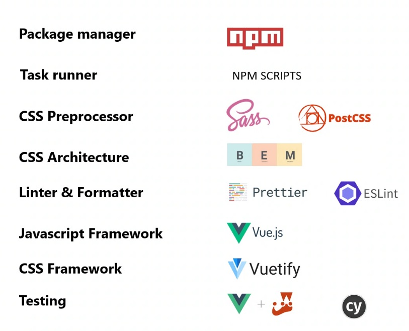
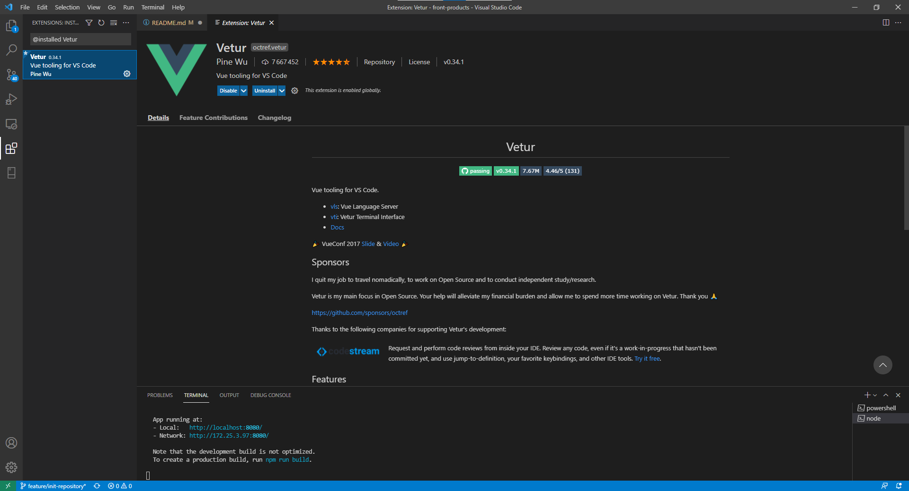

# Introduction 
Ce projet contient les composants et les pages nécessaires à la gestion des paramétrages G-COM Réassort.  
On utilise la stack technique suivante dans ce projet : 



## NODE JS
Pour le développement, il faudra installer une version récente de Node.js [Node.js](https://nodejs.org/fr/download/current/)
et vérifier que qu'une version récente de Python est également installée

## IDE
Pour le développement de ce projet, nous utiliseront de préférence l'IDE [Visual Studio Code](https://code.visualstudio.com/Download)  
Il faudra potentiellement installer le BuildTool "Visual C++ build tools" [cf:La partie "On Windows"](https://github.com/nodejs/node-gyp#on-windows)
et en fonction de sa version de Virtual Studio changer la date dans le 

`
npm config set msvs_version 2017
`

On utilisera ce plugin Vue pour aider au développement :  


## Project setup

```
npm install
npm audit fix
```

### Récupération des connexions aux APIs
Récupérez le fichier .env.local [ici](https://promod.sharepoint.com/:u:/s/dosi-supplyoffre/EeZXTofkBAJNpuUaWUIHxMYBJP4m6yozSNoI9WgtiV5bkw?e=Ldue5h)  
Renommez-le si besoin en .env.local et mettez-le à la racine du projet

### Compiles and hot-reloads for development
```
npm run serve
```

### Compiles and minifies for production
```
npm run build
```

### Run your unit tests
```
npm run test:unit
```

### Run your end-to-end tests
```
npm run test:e2e
```

### Lints and fixes files
```
npm run lint
```

### Customize configuration
See [Configuration Reference](https://cli.vuejs.org/config/).